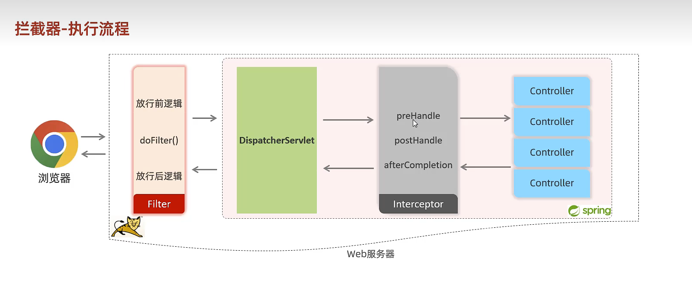

## 阅读以下内容以便于您快速掌握本项目
### 项目背景：
跟随黑马程序员的视频教程，学习Vue.js框架，实现一个javaWeb后端的小项目
### 项目介绍：
本项目是一个基于Vue.js框架的前端项目，后端使用javaWeb技术，实现了一个简单的员工管理系统
### 项目功能：
1. 登录
2. 员工管理
3. 部门管理
### 项目技术：
对于登录功能，使用了axios进行前后端交互，使用了element-ui的表单组件，使用了jwt进行token验证
对于员工管理功能，使用了axios进行前后端交互，使用了element-ui的表格组件，使用了element-ui的分页组件，使用了element-ui的对话框组件，使用了element-ui的表单组件，使用了element-ui的下拉框组件，使用了element-ui的级联选择器组件，使用了element-ui的日期选择器组件，使用了element-ui的上传组件.
对于部门管理功能，使用了axios进行前后端交互，使用了element-ui的表格组件，使用了element-ui的分页组件，使用了element-ui的对话框组件，使用了element-ui的表单组件，使用了element-ui的下拉框组件，使用了element-ui的级联选择器组件，使用了element-ui的日期选择器组件，使用了element-ui的上传组件.
### 登录实现逻辑
1. 前端在登录页面输入用户名和密码，点击登录按钮
2. 后端接收到前端的请求，根据用户名和密码查询数据库，如果查询到了数据，就返回一个token给前端，如果没有查询到数据，就返回一个错误信息给前端
3. 前端接收到后端返回的数据，如果是token，就把token存储到localStorage中，如果是错误信息，就弹出错误信息
4. 之后前端访问web资源会先进入登录过滤器后端判断前端从localStorage携带到header中的token是否有效，如果有，就跳转到首页，如果没有，就跳转到登录页面
